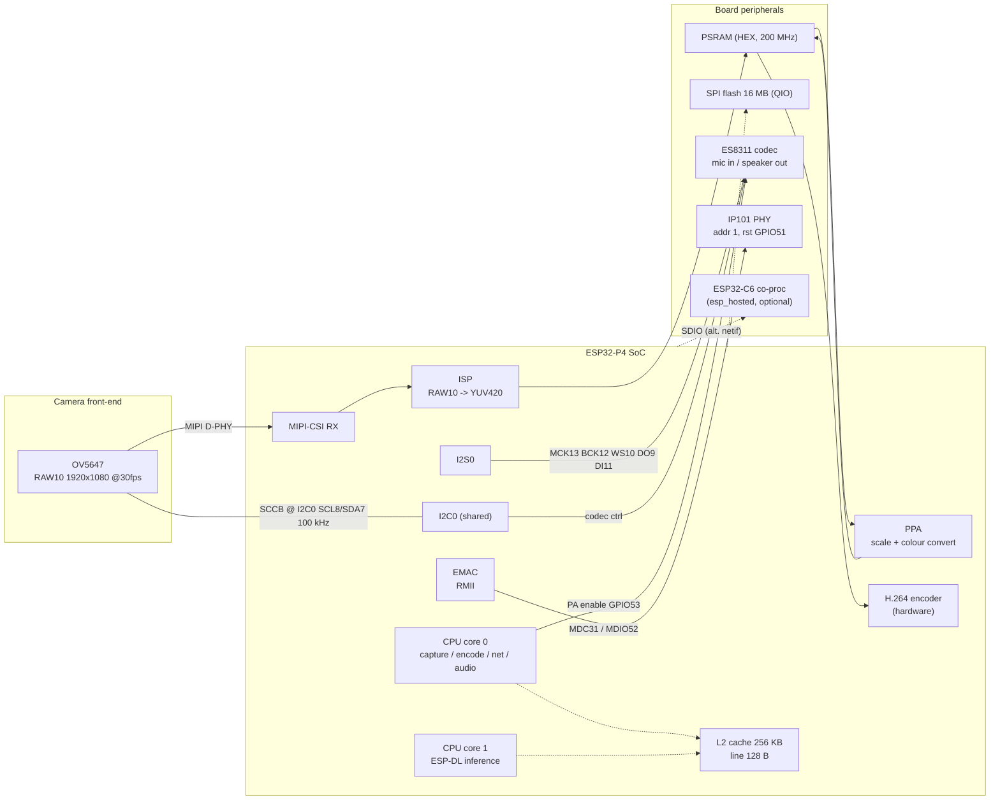
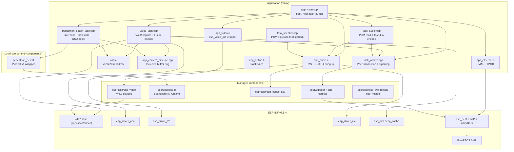
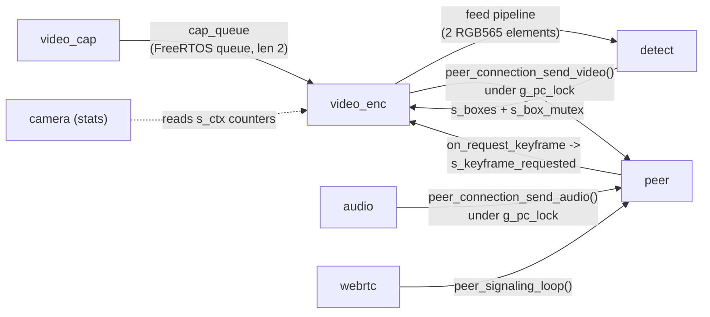
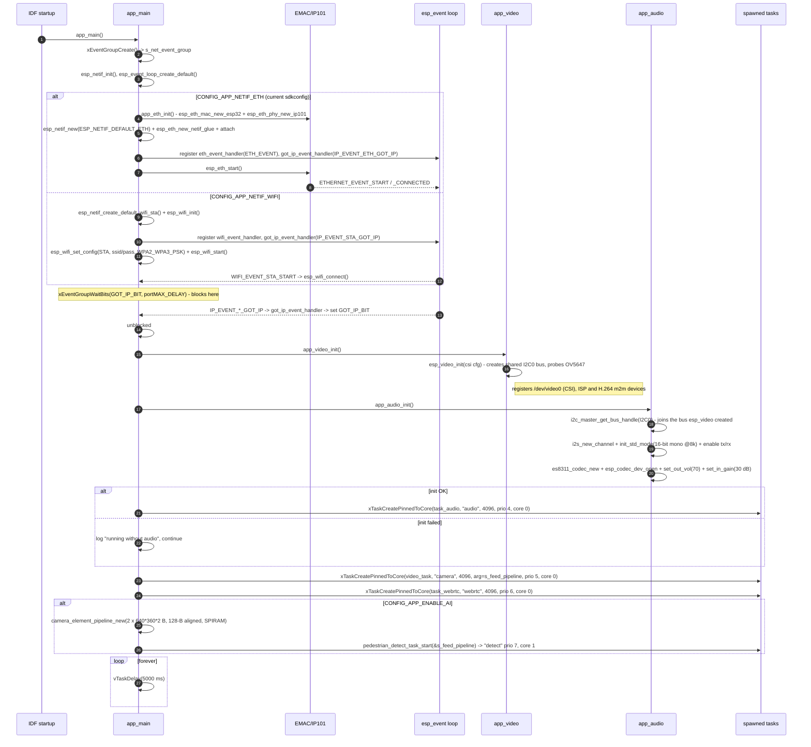
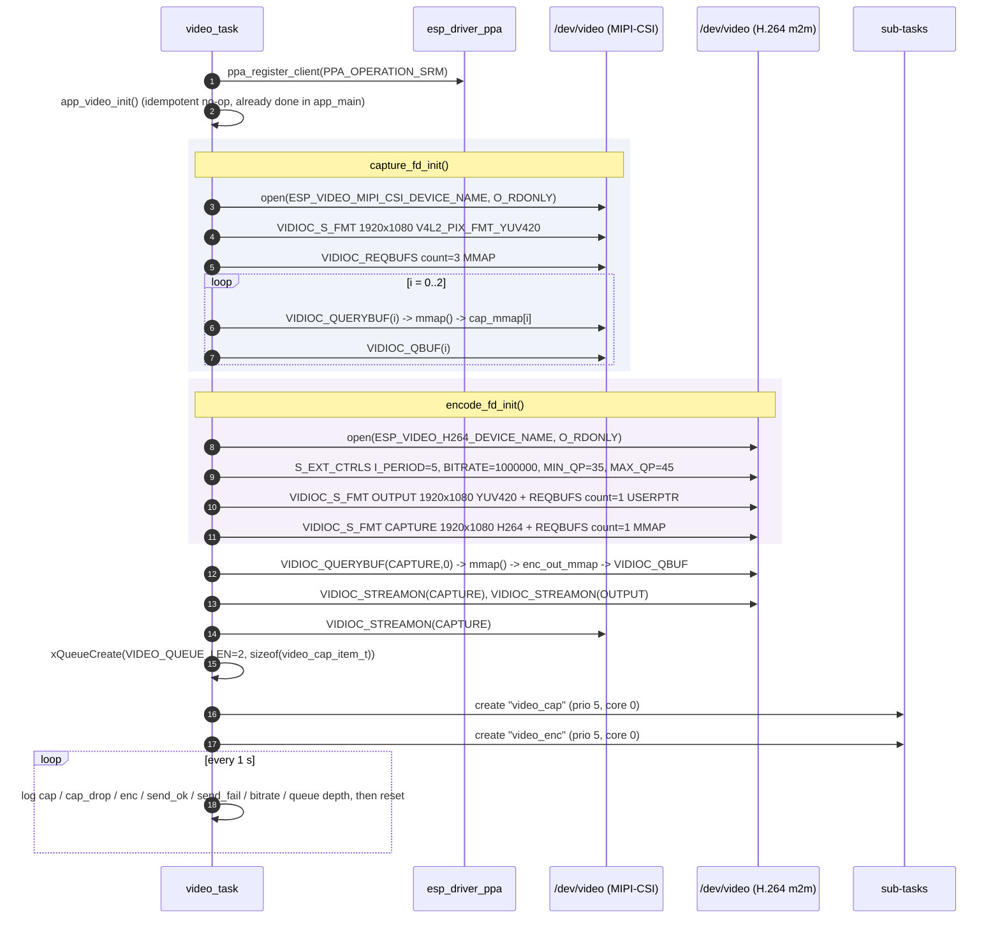
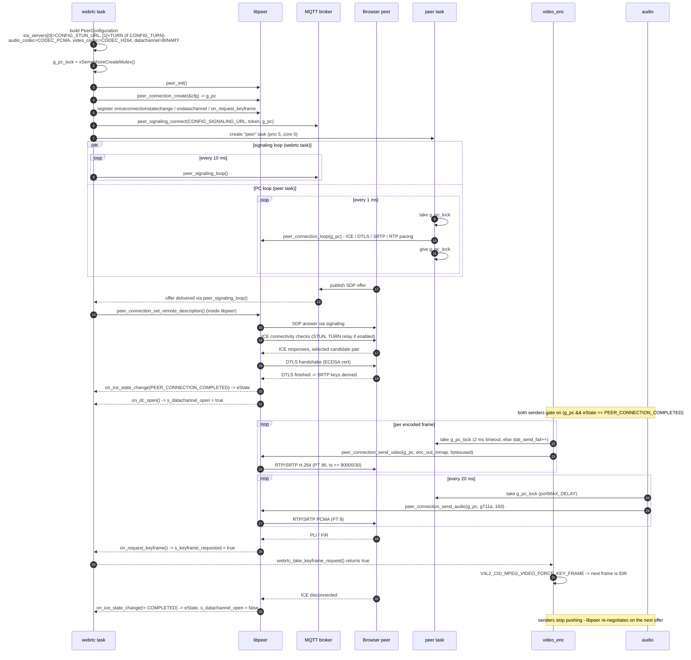

# Architecture

Structural reference for the ESP32-P4 IP camera firmware: hardware blocks, software
layers, tasks, and the boot / session sequences that wire them together.

For frame-by-frame buffer movement see [DATAFLOW.md](DATAFLOW.md).
For a short overview see [README.md](README.md).

---

## 1. What the system is

A single-binary ESP-IDF application on an ESP32-P4 that:

1. captures 1920x1080 YUV420 from an OV5647 MIPI-CSI sensor through the on-chip ISP,
2. runs an ESP-DL pedestrian detector on a PPA-downscaled copy of each frame,
3. burns the detection boxes into the full-resolution frame (OSD),
4. encodes the result with the hardware H.264 encoder,
5. captures mono 8 kHz audio from an ES8311 codec and encodes it as G.711-A,
6. ships both media streams to a browser over WebRTC (libpeer: ICE / DTLS-SRTP / RTP,
   MQTT signaling).

There is no local UI, no storage, and no HTTP server. The device is a pure
uplink-only WebRTC sender with a data channel open for control traffic.

---

## 2. Hardware block diagram

Notes:

- **I2C0 is shared** between the camera SCCB bus and the ES8311 control bus (both
  SCL=8, SDA=7). `esp_video_init()` creates the bus (`init_sccb = true`);
  `app_audio_init()` then calls `i2c_master_get_bus_handle()` to join it. This is why
  `app_video_init()` must run before `app_audio_init()` in `app_main`.
- **Networking is a compile-time choice** (`CONFIG_APP_NETIF_ETH` vs
  `CONFIG_APP_NETIF_WIFI`), not a runtime one. Current `sdkconfig` selects Ethernet.
- Wi-Fi goes through `esp_wifi_remote` / `esp_hosted` on a companion chip, since the
  P4 has no radio.

---

## 3. Software layer diagram

### File responsibilities

| File | Responsibility |
| --- | --- |
| [main/app_main.cpp](main/app_main.cpp) | Boot order, netif bring-up, blocks on `GOT_IP_BIT`, creates top-level tasks |
| [main/app_video.c](main/app_video.c) | Idempotent `esp_video_init()` with SCCB pin config; creates the shared I2C bus |
| [main/video_task.cpp](main/video_task.cpp) | V4L2 device setup, capture + encode sub-tasks, PPA feed, WebRTC video send, 1 s stats |
| [main/video_task.h](main/video_task.h) | `CAM_WIDTH/HEIGHT`, `CAP_BUF_COUNT`, `VIDEO_QUEUE_LEN`, H.264 rate-control constants |
| [main/pedestrian_detect_task.cpp](main/pedestrian_detect_task.cpp) | Detector instance, inference loop on core 1, mutex-protected box store, OSD application |
| [main/app_camera_pipeline.cpp](main/app_camera_pipeline.cpp) | Two-list (`queued`/`done`) buffer ring with a counting semaphore; the producer/consumer handoff to the detector |
| [main/osd.c](main/osd.c) | Rectangle rasteriser for packed `O_UYY_E_VYY` YUV420 |
| [main/app_audio.c](main/app_audio.c) | I2S std-mode channels, ES8311 codec object, volume / mic gain |
| [main/task_audio.cpp](main/task_audio.cpp) | 20 ms PCM reads, linear16 -> G.711-A, WebRTC audio send |
| [main/task_speaker.cpp](main/task_speaker.cpp) | Loops an embedded `canon.pcm` to the speaker — **compiled but never started** |
| [main/task_webrtc.cpp](main/task_webrtc.cpp) | `PeerConnection` lifecycle, ICE callbacks, keyframe-request flag, signaling + PC poll loops |
| [main/app_ethernet.c](main/app_ethernet.c) | ESP32 EMAC + IP101 PHY driver install |
| [components/pedestrian_detect](components/pedestrian_detect) | `PedestrianDetect` wrapper: Pico s8 v1 model, preprocessor, `PicoPostprocessor` |

---

## 4. Task model

Every task except the detector is pinned to **core 0**. Core 1 runs only ESP-DL
inference, which is what keeps the ~51 ms Pico inference from stalling the encoder.

| Task name | Entry point | Core | Prio | Stack | Created by |
| --- | --- | --- | --- | --- | --- |
| `main` | `app_main` | 0 | 1 | 3584 | IDF startup |
| `audio` | `task_audio` | 0 | 4 | 4096 | [app_main.cpp:172](main/app_main.cpp#L172) |
| `camera` | `video_task` | 0 | 5 | 4096 | [app_main.cpp:179](main/app_main.cpp#L179) |
| `webrtc` | `task_webrtc` | 0 | 6 | 4096 | [app_main.cpp:183](main/app_main.cpp#L183) |
| `video_cap` | `video_capture_task` | 0 | 5 | 4096 | [video_task.cpp:387](main/video_task.cpp#L387) |
| `video_enc` | `video_encode_task` | 0 | 5 | 4096 | [video_task.cpp:391](main/video_task.cpp#L391) |
| `peer` | `peer_connection_task` | 0 | 5 | 8192 | [task_webrtc.cpp:102](main/task_webrtc.cpp#L102) |
| `detect` | `detect_task` | 1 | 7 | 8192 | [pedestrian_detect_task.cpp:105](main/pedestrian_detect_task.cpp#L105) |

After spawning the sub-tasks, `video_task` itself degenerates into a 1 Hz statistics
printer, and `app_main` into a 5 s idle loop.

### Task interaction graph

### Shared state

| Symbol | Owner | Readers | Protection |
| --- | --- | --- | --- |
| `g_pc`, `eState` | `webrtc` | `video_enc`, `audio` | plain reads; `eState` written from ICE callback |
| `g_pc_lock` | `webrtc` | `video_enc` (2 ms timeout), `audio` (infinite), `peer` | FreeRTOS mutex |
| `s_keyframe_requested` | libpeer callback | `video_enc` | `volatile bool`, read-and-clear |
| `s_boxes` / `s_box_count` | `detect` | `video_enc` (via `pedestrian_detect_overlay_last_boxes`) | `s_box_mutex` |
| feed pipeline lists | shared | `video_enc` (producer), `detect` (consumer) | `portMUX_TYPE` spinlock + counting semaphore |
| `s_ctx` stats | `video_cap` / `video_enc` | `camera` | none (non-atomic counters, stats only) |

---

## 5. Boot sequence

> **Ordering defect.** `video_task` is handed `s_feed_pipeline` at
> [app_main.cpp:179](main/app_main.cpp#L179), but the pipeline is only allocated at
> [app_main.cpp:194](main/app_main.cpp#L194). The camera task therefore captures a
> `NULL` handle, and `convert_to_rgb_for_detector()` returns immediately at its
> `if (!feed)` guard — the detector never receives a frame. Moving the
> `camera_element_pipeline_new()` block above the `video_task` creation fixes it.

### video_task internal init

---

## 6. WebRTC session sequence

`task_webrtc` has `failed1`/`failed2` cleanup labels, but the success path never
reaches them — the function loops forever on `peer_signaling_loop()`. There is no
teardown path for the PeerConnection.

---

## 7. Configuration surface

All project options live in [main/Kconfig.projbuild](main/Kconfig.projbuild) under four
menus, plus the model options in
[components/pedestrian_detect/Kconfig](components/pedestrian_detect/Kconfig).

| Menu | Key options | Current value in `sdkconfig` |
| --- | --- | --- |
| IPC Internet | `APP_NETIF_ETH` / `APP_NETIF_WIFI` choice | `ETH` |
| | `ESP_ETH_PHY_ADDR` / `_RST_GPIO` / `_MDC_GPIO` / `_MDIO_GPIO` | 1 / 51 / 31 / 52 |
| | `ESP_WIFI_SSID` / `_PASSWORD` (Wi-Fi build only) | — |
| IPC Wertc | `SIGNALING_URL` | `mqtts://broker.emqx.io/public/striped-lazy-panda` |
| | `SIGNALING_TOKEN` | *(empty)* |
| | `STUN_URL` | `stun:stun-connect.fcam.vn:3478` |
| | `TURN` / `TURN_URL` / `_USERNAME` / `_CREDENTIAL` | enabled, `turn:turn-connect.fcam.vn:3478` |
| IPC Features | `APP_ENABLE_AI` | `y` |
| IPC Video | `APP_MIPI_CSI_SCCB_I2C_PORT` / `_SCL_PIN` / `_SDA_PIN` / `_FREQ` | 0 / 8 / 7 / 100000 |
| | `APP_MIPI_CSI_SENSOR_RESET_PIN` / `_PWDN_PIN` | -1 / -1 (unused) |
| IPC Audio | `APP_AUDIO_I2C_NUM` / `I2S_NUM` | 0 / 0 |
| | `APP_AUDIO_I2S_MCK/BCK/WS/DO/DI_IO`, `PA_IO` | 13 / 12 / 10 / 9 / 11, 53 |
| | `APP_AUDIO_SAMPLE_RATE` / `MCLK_MULTIPLE` | 8000 / 384 |
| | `APP_AUDIO_VOLUME` / `MIC_GAIN_DB` | 70 / `"30.0"` |
| models: pedestrian_detect | `PEDESTRIAN_DETECT_PICO_S8_V1`, model location | `y`, flash rodata |

Compile-time constants that are **not** Kconfig options:

| Constant | File | Value |
| --- | --- | --- |
| `CAM_WIDTH` / `CAM_HEIGHT` | [video_task.h](main/video_task.h#L7-L8) | 1920 / 1080 |
| `CAP_BUF_COUNT` | [video_task.h](main/video_task.h#L9) | 3 |
| `VIDEO_QUEUE_LEN` | [video_task.h](main/video_task.h#L10) | 2 |
| `H264_I_PERIOD` / `BITRATE` / `MIN_QP` / `MAX_QP` | [video_task.h](main/video_task.h#L12-L15) | 5 / 1000000 / 35 / 45 |
| `PED_DETECT_WIDTH` / `_HEIGHT` / `_MAX_BOX` | [pedestrian_detect_task.h](main/pedestrian_detect_task.h#L7-L9) | 640 / 360 / 10 |
| `OSD_Y/U/V`, `OSD_THICKNESS` | [pedestrian_detect_task.cpp](main/pedestrian_detect_task.cpp#L21-L24) | 76/84/255, 4 px (red) |
| `AUDIO_READ_BYTES` | [task_audio.cpp](main/task_audio.cpp#L13) | 320 (20 ms @ 8 kHz int16) |
| `TASK_*_STACK_SIZE` | [app_define.h](main/app_define.h) | 4096 each |

---

## 8. Memory layout

### Flash / partitions

[partitions.csv](partitions.csv):

| Name | Type | Offset | Size |
| --- | --- | --- | --- |
| `nvs` | data/nvs | 0x9000 | 24 KB |
| `phy_init` | data/phy | 0xf000 | 4 KB |
| `factory` | app/factory | 0x10000 | **4 MB** |

The 4 MB app partition is oversized on purpose: `PEDESTRIAN_DETECT_MODEL_IN_FLASH_RODATA`
links the packed `.espdl` model into the binary, and `canon.pcm` (625 KB) is embedded
via `EMBED_FILES`.

### RAM

| Allocation | Where | Size | Notes |
| --- | --- | --- | --- |
| 3x capture buffers | V4L2 mmap (driver-allocated) | 3 x ~3.1 MB | 1920x1080x1.5 packed YUV420 |
| 1x H.264 bitstream buffer | V4L2 mmap | driver-sized | single output slot |
| 2x detector feed buffers | `MALLOC_CAP_SPIRAM`, 128-B aligned | 2 x 450 KB | 640x360x2 RGB565 |
| ESP-DL model working set | internal + PSRAM | model-dependent | only when `APP_ENABLE_AI=y` |
| libpeer ring buffers | patched to `MALLOC_CAP_SPIRAM` | audio / video / data | see §9 |
| mbedTLS heap | `CONFIG_MBEDTLS_EXTERNAL_MEM_ALLOC=y` | PSRAM | keeps DTLS off internal RAM |

Internal DMA-capable RAM is the scarce resource. Enabling Wi-Fi (`esp_hosted`) together
with `APP_ENABLE_AI=y` has been observed to exhaust it at boot; `APP_ENABLE_AI` exists
specifically as the escape hatch.

Cache config matters for correctness: `CONFIG_CACHE_L2_CACHE_LINE_128B` is why the
detector buffers are allocated with `align_size = 128` — `esp_cache_msync()` requires
line-aligned addresses (see [DATAFLOW.md §6](DATAFLOW.md#6-cache-coherency)).

---

## 9. Dependencies and local patches

Declared in [main/idf_component.yml](main/idf_component.yml):

| Component | Version | Used for |
| --- | --- | --- |
| `espressif/esp_video` | 2.2.0 | V4L2 MIPI-CSI, ISP, H.264 m2m devices |
| `espressif/esp-dl` | ~3.1.0 | quantised NN runtime for the Pico detector |
| `espressif/esp_codec_dev` | ^1.5.10 | ES8311 driver + I2S data interface |
| `sepfy/libpeer` | ^0.0.3 | WebRTC (ICE / DTLS-SRTP / RTP / MQTT signaling) |
| `espressif/esp_wifi_remote` | 1.6.1 | Wi-Fi via `esp_hosted` co-processor |

`managed_components/` is git-ignored and re-fetched by the component manager, so local
fixes live as patch files applied by `./patches/apply.sh` (idempotent):

- **`patches/sepfy__libpeer.patch`** — the substantive one:
  - `buffer.c`: ring-buffer backing store moved to `heap_caps_calloc(..., MALLOC_CAP_SPIRAM)`
    under `#ifdef ESP_PLATFORM`, plus NULL-guards on alloc/free/append.
  - `config.h`: `CONFIG_DTLS_USE_ECDSA 1`, `CONFIG_SDP_BUFFER_SIZE 4096`,
    `CONFIG_CODEC_H264_FPS 30`.
  - `rtp.c`: H.264 timestamp increment becomes `90000 / CONFIG_CODEC_H264_FPS` instead
    of a hardcoded 15 fps value.
  - `dtls_srtp.c`: `VERIFY_OPTIONAL` authmode, CA chain / own cert / RNG wiring,
    1 s read timeout, remote-fingerprint validation.
  - `peer_connection.c`: ring-buffer NULL checks, fingerprint reset on renegotiation,
    drain loops over `buffer_peak_head()` for audio/video.
  - `agent.c` / `ice.c`: `ice_candidate_from_description()` return checked before
    `remote_candidates_count++`; timing instrumentation on candidate gathering.
- **`patches/sepfy__srtp.patch`** — suppresses `-Werror=incompatible-pointer-types`
  caused by `uint32_t == unsigned long` on RISC-V.

The root [CMakeLists.txt](CMakeLists.txt) also forces
`CMAKE_POLICY_VERSION_MINIMUM=3.5` (both cache and env) so CMake 4.x accepts the
libpeer/srtp/usrsctp component CMake files, and sets `MINIMAL_BUILD ON`.

---

## 10. Known gaps

Recorded as-is; none of these are fixed by this document.

| # | Issue | Location |
| --- | --- | --- |
| 1 | `s_feed_pipeline` is passed to `video_task` before it is allocated -> detector feed is always `NULL` | [app_main.cpp:179](main/app_main.cpp#L179) vs [:194](main/app_main.cpp#L194) |
| 2 | On `cap_queue` overflow the capture buffer is dropped **without** `VIDIOC_QBUF` — the re-queue is commented out, so the camera permanently loses that buffer | [video_task.cpp:153-157](main/video_task.cpp#L153-L157) |
| 3 | `pedestrian_detect_task_start()` stub does `return ESP_OK;` from a `void` function -> build breaks when `APP_ENABLE_AI=n`; `pedestrian_detect_overlay_last_boxes()` has no stub in that branch | [pedestrian_detect_task.cpp:139-142](main/pedestrian_detect_task.cpp#L139-L142) |
| 4 | `task_speaker` and its 625 KB embedded `canon.pcm` are compiled and linked but the task is never created | [task_speaker.cpp](main/task_speaker.cpp), [CMakeLists.txt](main/CMakeLists.txt#L9) |
| 5 | `pedestrian_detect_get_boxes()` is exported but has no callers | [pedestrian_detect_task.h:30](main/pedestrian_detect_task.h#L30) |
| 6 | `video_encode_task` logs `"video_capture_task started"` | [video_task.cpp:169](main/video_task.cpp#L169) |
| 7 | `audio` takes `g_pc_lock` with `portMAX_DELAY` while `video_enc` uses a 2 ms timeout — the audio task can block behind `peer_connection_loop()` | [task_audio.cpp:81](main/task_audio.cpp#L81) |
| 8 | The doc comment in `video_task.h` still claims "~15 fps pacing"; no pacing code exists | [video_task.h:17-20](main/video_task.h#L17-L20) |
