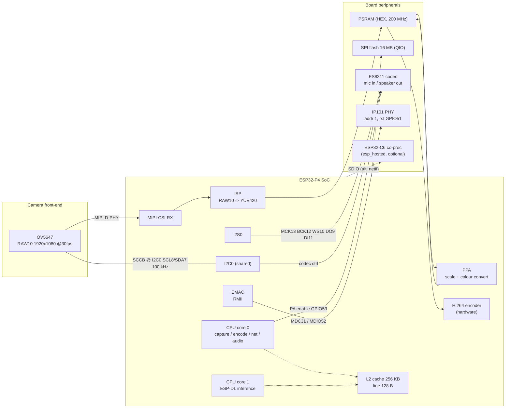
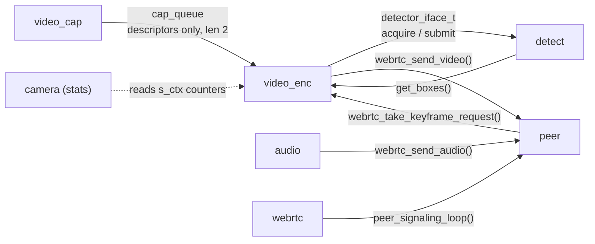
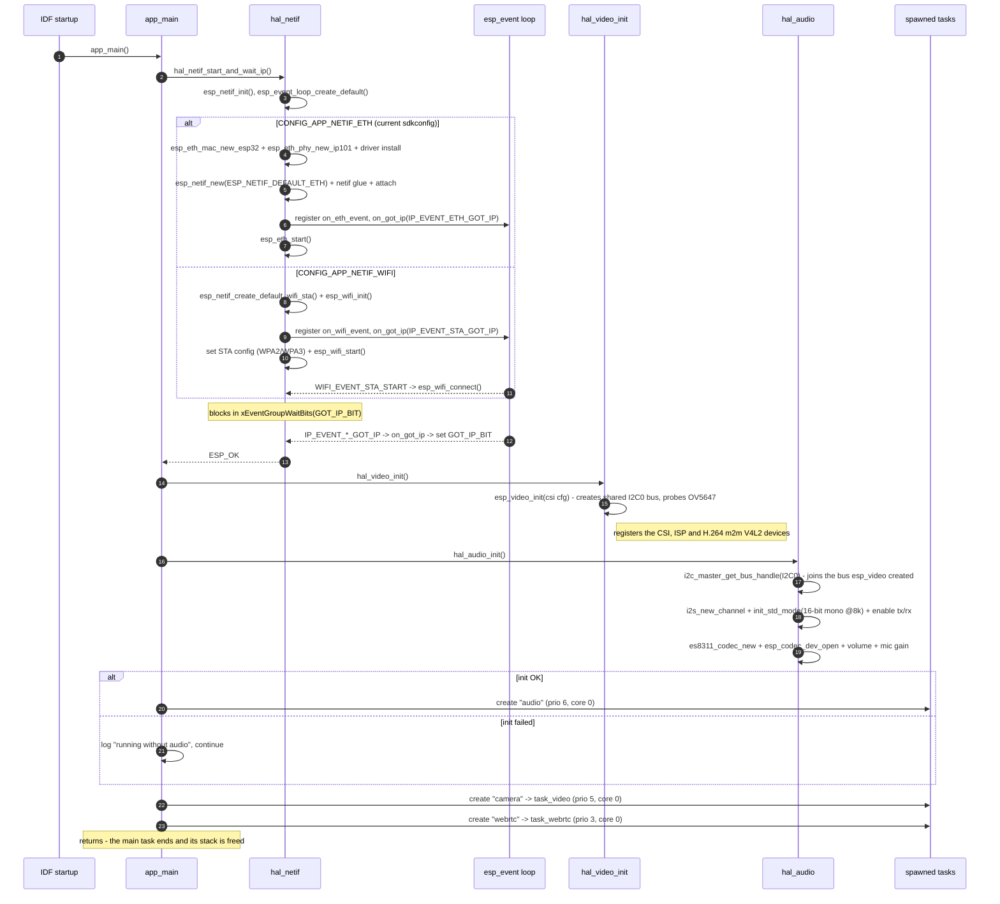
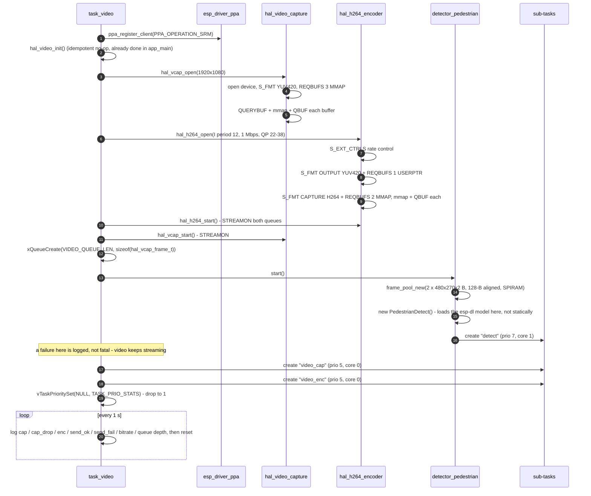
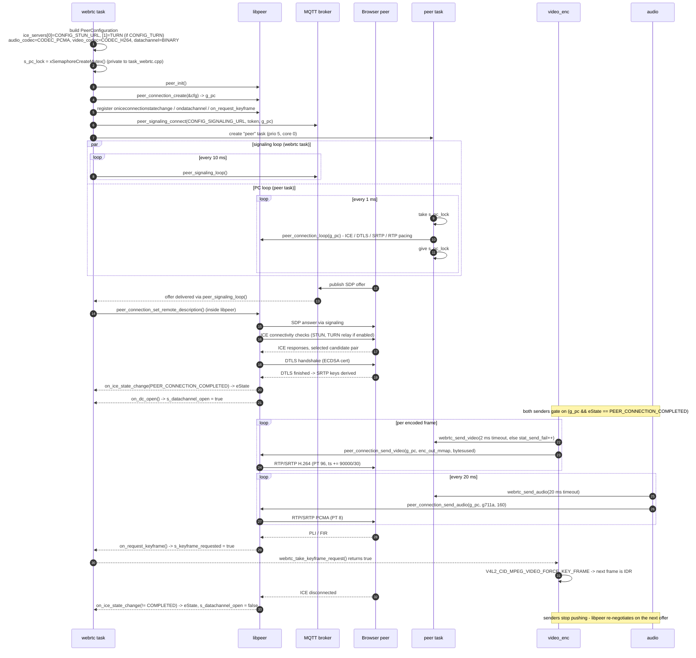

# Architecture

Structural reference for the ESP32-P4 IP camera firmware: hardware blocks, software
layers, tasks, and the boot / session sequences that wire them together.

For frame-by-frame buffer movement see [DATAFLOW.md](DATAFLOW.md).
For a short overview see [README.md](README.md).

---

## 1. What the system is

A single-binary ESP-IDF application on an ESP32-P4 that:

1. captures 1920x1080 YUV420 from an OV5647 MIPI-CSI sensor through the on-chip ISP,
2. runs an ESP-DL pedestrian detector on a PPA-downscaled copy of each frame,
3. burns the detection boxes into the full-resolution frame (OSD),
4. encodes the result with the hardware H.264 encoder,
5. captures mono 8 kHz audio from an ES8311 codec and encodes it as G.711-A,
6. ships both media streams to a browser over WebRTC (libpeer: ICE / DTLS-SRTP / RTP,
   MQTT signaling).

There is no local UI, no storage, and no HTTP server. The device is a pure
uplink-only WebRTC sender with a data channel open for control traffic.

---

## 2. Hardware block diagram

Notes:

- **I2C0 is shared** between the camera SCCB bus and the ES8311 control bus (both
  SCL=8, SDA=7). `esp_video_init()` creates the bus (`init_sccb = true`);
  `hal_audio_init()` then calls `i2c_master_get_bus_handle()` to join it. This is why
  `hal_video_init()` must run before `hal_audio_init()` in `app_main`.
- **Networking is a compile-time choice** (`CONFIG_APP_NETIF_ETH` vs
  `CONFIG_APP_NETIF_WIFI`), not a runtime one. Current `sdkconfig` selects Ethernet.
- Wi-Fi goes through `esp_wifi_remote` / `esp_hosted` on a companion chip, since the
  P4 has no radio.

---

## 3. Software layer diagram

`main/` is split into three layers. Nothing in `hal/` knows application policy,
nothing in `core/` owns a FreeRTOS task, and each file in `task/` owns exactly one.

```mermaid
graph TD
    subgraph TASK["task/ - one FreeRTOS task each"]
        TV["task_video.cpp<br/>capture + encode orchestration, 1 Hz stats"]
        TD["task_detect.cpp<br/>inference loop, box store"]
        TA["task_audio.cpp<br/>PCM read + G.711-A encode"]
        TW["task_webrtc.cpp<br/>PeerConnection + signaling"]
    end

    subgraph CORE["core/ - app services, no tasks"]
        WAPI["webrtc_api.h<br/>send video/audio, keyframe request"]
        DET["detector.h<br/>detector_iface_t - the swap point"]
        OSD["osd.c<br/>YUV420 box rasteriser + dirty span"]
        POOL["frame_pool.cpp<br/>zero-copy producer/consumer buffers"]
    end

    subgraph HAL["hal/ - thin wrappers, no policy, no globals"]
        HVC["hal_video_capture.c<br/>V4L2 MIPI-CSI"]
        HENC["hal_h264_encoder.c<br/>V4L2 m2m encoder"]
        HPPA["hal_ppa.c<br/>YUV420 -> RGB565 + exact-scale guard"]
        HAUD["hal_audio.c<br/>I2S + ES8311"]
        HNET["hal_netif.c<br/>Ethernet or Wi-Fi, waits for IP"]
        HVI["hal_video_init.c<br/>esp_video_init + shared I2C bus"]
    end

    MAIN["app_main.cpp<br/>boot only"]
    CFG["app_config.h<br/>every tunable"]

    subgraph EXT["Components"]
        PD["components/pedestrian_detect<br/>Pico s8 v1 wrapper"]
        ESPVIDEO["esp_video - V4L2 devices"]
        ESPDL["esp-dl - quantised NN runtime"]
        CODECDEV["esp_codec_dev"]
        LIBPEER["libpeer + srtp + usrsctp"]
        IDF["ESP-IDF: PPA, I2S, I2C, esp_cache, lwIP, FreeRTOS"]
    end

    MAIN --> HNET & HVI & HAUD & TV & TA & TW
    TV --> HVC & HENC & HPPA & DET & OSD & WAPI
    TD --> POOL & DET & PD
    TA --> HAUD & WAPI
    TW --> WAPI & LIBPEER
    TD -. "implements" .-> DET
    OSD --> DET
    PD --> ESPDL
    HAUD --> CODECDEV
    HVI --> ESPVIDEO
    HVC & HENC --> ESPVIDEO
    HNET & LIBPEER --> IDF
    HPPA --> IDF
    CFG -.-> TASK & CORE & HAL
```

The two edges that matter most are the ones that are *absent*: `task_video` has no
route to libpeer except through `webrtc_api`, and no route to the detector except
through `detector_iface_t`.

### File responsibilities

| File | Responsibility |
| --- | --- |
| [main/app_main.cpp](main/app_main.cpp) | Boot only: network up, video + audio init, spawn tasks, return |
| [main/app_config.h](main/app_config.h) | Every tunable: resolutions, rate control, stacks, priorities, cores |
| **hal/** | |
| [hal_video_capture.c](main/hal/hal_video_capture.c) | V4L2 MIPI-CSI: format, buffer mapping, acquire/release, and publishing CPU edits to DMA readers |
| [hal_h264_encoder.c](main/hal/hal_h264_encoder.c) | V4L2 m2m: rate control, encode one frame, force IDR |
| [hal_ppa.c](main/hal/hal_ppa.c) | YUV420 -> RGB565 downscale + `HAL_PPA_SCALE_IS_EXACT` guard |
| [hal_audio.c](main/hal/hal_audio.c) | I2S std-mode channels, ES8311 codec, volume / mic gain |
| [hal_netif.c](main/hal/hal_netif.c) | Ethernet or Wi-Fi bring-up behind one call that blocks until DHCP |
| [hal_video_init.c](main/hal/hal_video_init.c) | `esp_video_init()` with SCCB pins; creates the shared I2C bus |
| **core/** | |
| [webrtc_api.h](main/core/webrtc_api.h) | The only route to the PeerConnection; owns the gate-and-lock policy |
| [detector.h](main/core/detector.h) | `detector_iface_t`: acquire/submit/discard input, read boxes back |
| [osd.c](main/core/osd.c) | Corner-mark rasteriser for packed `O_UYY_E_VYY`; reports the row bands it dirtied, and knows nothing about cache |
| [frame_pool.cpp](main/core/frame_pool.cpp) | Free/ready lists + counting semaphore for zero-copy handoff |
| [libpeer_config.h](main/core/libpeer_config.h) | The libpeer settings the app must agree with; force-included into that component |
| **task/** | |
| [task_video.cpp](main/task/task_video.cpp) | Capture + encode sub-tasks, detector feed, OSD, send, 1 Hz stats |
| [task_detect.cpp](main/task/task_detect.cpp) | Inference on core 1, box store; implements `detector_pedestrian` |
| [task_audio.cpp](main/task/task_audio.cpp) | 20 ms PCM reads, linear16 -> G.711-A, send |
| [task_webrtc.cpp](main/task/task_webrtc.cpp) | PeerConnection lifecycle, ICE callbacks, signaling + PC poll loops |
| [components/pedestrian_detect](components/pedestrian_detect) | `PedestrianDetect`: Pico s8 v1 model, preprocessor, `PicoPostprocessor` |

---

## 4. Task model

Every task except the detector is pinned to **core 0**. Core 1 runs only ESP-DL
inference, which is what keeps the ~100 ms Pico inference from stalling the encoder.

Priorities follow how hard each deadline is. Audio outranks video because it must
call `esp_codec_dev_read()` every 20 ms or the I2S RX ring overruns, whereas a late
video frame only costs a frame. The 1 ms `peer` loop outranks the 10 ms signaling
poll. All of it is declared in [app_config.h](main/app_config.h).

| Task name | Entry point | Core | Prio | Stack | Created by |
| --- | --- | --- | --- | --- | --- |
| `main` | `app_main` | 0 | 1 | 3584 | IDF startup (returns once tasks are up) |
| `detect` | `detect_task` | 1 | 7 | 8192 | `detector_pedestrian.start()` |
| `audio` | `task_audio` | 0 | 6 | 4096 | [app_main.cpp](main/app_main.cpp) |
| `peer` | `peer_connection_task` | 0 | 6 | 8192 | [task_webrtc.cpp](main/task/task_webrtc.cpp) |
| `video_cap` | `video_capture_task` | 0 | 5 | 4096 | [task_video.cpp](main/task/task_video.cpp) |
| `video_enc` | `video_encode_task` | 0 | 5 | 4096 | [task_video.cpp](main/task/task_video.cpp) |
| `camera` | `task_video` | 0 | 5 -> 1 | 4096 | [app_main.cpp](main/app_main.cpp) |
| `webrtc` | `task_webrtc` | 0 | 3 | 4096 | [app_main.cpp](main/app_main.cpp) |

`camera` runs at 5 while it opens the V4L2 devices, then calls `vTaskPrioritySet()`
to drop itself to 1 — from that point it only prints statistics once a second and
must not outrank the tasks doing the work.

### Task interaction graph

### Shared state

| Symbol | Owner | Readers | Protection |
| --- | --- | --- | --- |
| `s_pc`, `s_state`, `s_pc_lock` | `task_webrtc.cpp` | none — private; reached only via `webrtc_send_*()` | FreeRTOS mutex, taken inside the API |
| `s_keyframe_requested` | libpeer callback | `video_enc` via `webrtc_take_keyframe_request()` | `volatile bool`, read-and-clear |
| `s_boxes` / `s_box_count` | `detect` | `video_enc` via `get_boxes()` | `s_box_mutex` |
| frame pool lists | shared | `video_enc` (producer), `detect` (consumer) | `portMUX_TYPE` spinlock + counting semaphore |
| `s_ctx` stats | `video_cap` / `video_enc` | `camera` | none (non-atomic counters, stats only) |

---

## 5. Boot sequence

### 5.0 The constructor phase, before `app_main`

IDF runs `do_global_ctors()` during startup, and components can hook it. This phase
allocates from internal RAM while nothing has had a chance to configure anything, and a
failure there is a boot-time panic rather than a recoverable error.

- **esp_hosted** registers `esp_hosted_host_init()` as a
  `__attribute__((constructor))` ([port_esp_hosted_host_init.c:17](managed_components/espressif__esp_hosted/host/port/esp/freertos/src/port_esp_hosted_host_init.c#L17)).
  It runs unconditionally whenever the component is compiled in, with no runtime gate,
  and requests ~39 KB of `MALLOC_CAP_INTERNAL | MALLOC_CAP_DMA` for its transport
  mempool (`H_TRANSPORT_QUEUE_SIZE 20 + MEMPOOL_PADDING 5` blocks x
  `ESP_TRANSPORT_MAX_BUF_SIZE 1600`). On failure it `assert()`s.
  Because `esp_wifi` is a `PRIV_REQUIRES` of `main` and maps to
  `esp_wifi_remote -> esp_hosted` on the P4, this happens in **Ethernet builds too**.
  `CONFIG_ESP_HOSTED_ENABLED` is therefore forced off in
  [sdkconfig.defaults](sdkconfig.defaults), and `APP_NETIF_WIFI` selects it back on.
- **The detector** must *not* join this phase. `s_detect` is a `PedestrianDetect *`
  built inside `detector_pedestrian.start()`, not a file-scope instance — a static
  instance would load the esp-dl model from a constructor and take the internal RAM
  that other components' constructors are about to ask for.

The rule: nothing in this project may claim significant internal RAM from a global
constructor.

### 5.1 `app_main`

### 5.2 `task_video` internal init

---

## 6. WebRTC session sequence

`task_webrtc` has `failed1`/`failed2` cleanup labels, but the success path never
reaches them — the function loops forever on `peer_signaling_loop()`. There is no
teardown path for the PeerConnection.

---

## 7. Configuration surface

All project options live in [main/Kconfig.projbuild](main/Kconfig.projbuild) under four
menus, plus the model options in
[components/pedestrian_detect/Kconfig](components/pedestrian_detect/Kconfig).

| Menu                      | Key options                                                              | Current value in`sdkconfig`                        |
| ------------------------- | ------------------------------------------------------------------------ | ---------------------------------------------------- |
| IPC Internet              | `APP_NETIF_ETH` / `APP_NETIF_WIFI` choice (WIFI `select`s `ESP_HOSTED_ENABLED`) | `ETH`                                    |
|                           | `ESP_ETH_PHY_ADDR` / `_RST_GPIO` / `_MDC_GPIO` / `_MDIO_GPIO`    | 1 / 51 / 31 / 52                                     |
|                           | `ESP_WIFI_SSID` / `_PASSWORD` (Wi-Fi build only)                     | —                                                   |
| IPC Wertc                 | `SIGNALING_URL`                                                        | `mqtts://broker.emqx.io/public/striped-lazy-panda` |
|                           | `SIGNALING_TOKEN`                                                      | *(empty)*                                          |
|                           | `STUN_URL`                                                             | `stun:stun-connect.fcam.vn:3478`                   |
|                           | `TURN` / `TURN_URL` / `_USERNAME` / `_CREDENTIAL`                | enabled,`turn:turn-connect.fcam.vn:3478`           |
| IPC Features              | `APP_ENABLE_AI`                                                        | `y`                                                |
| IPC Video                 | `APP_MIPI_CSI_SCCB_I2C_PORT` / `_SCL_PIN` / `_SDA_PIN` / `_FREQ` | 0 / 8 / 7 / 100000                                   |
|                           | `APP_MIPI_CSI_SENSOR_RESET_PIN` / `_PWDN_PIN`                        | -1 / -1 (unused)                                     |
| IPC Audio                 | `APP_AUDIO_I2C_NUM` / `I2S_NUM`                                      | 0 / 0                                                |
|                           | `APP_AUDIO_I2S_MCK/BCK/WS/DO/DI_IO`, `PA_IO`                         | 13 / 12 / 10 / 9 / 11, 53                            |
|                           | `APP_AUDIO_SAMPLE_RATE` / `MCLK_MULTIPLE`                            | 8000 / 384                                           |
|                           | `APP_AUDIO_VOLUME` / `MIC_GAIN_DB`                                   | 70 /`"30.0"`                                       |
| *(esp_hosted)*            | `ESP_HOSTED_ENABLED` — forced off in `sdkconfig.defaults`, see §5.0     | `n` (Ethernet build)                               |
| models: pedestrian_detect | `PEDESTRIAN_DETECT_PICO_S8_V1`, model location                         | `y`, flash rodata                                  |

Everything that is **not** a Kconfig option now lives in one file,
[main/app_config.h](main/app_config.h): frame and detector resolutions, H.264 rate
control, OSD colour, audio packet size, WebRTC lock timeouts, and every task stack,
priority and core assignment. Notable current values:

| Constant | Value | Note |
| --- | --- | --- |
| `CAM_WIDTH` / `CAM_HEIGHT` | 1920 / 1080 | |
| `CAP_BUF_COUNT` / `VIDEO_QUEUE_LEN` | 3 / 2 | queue depth derives from the buffer count |
| `ENC_OUT_BUF_COUNT` | 2 | lets encode overlap the RTP send |
| `H264_TARGET_FPS` | 12 | the delivered rate; see §10 for why it is not free |
| `H264_I_PERIOD` / `BITRATE` / `MIN_QP` / `MAX_QP` | = TARGET_FPS / 1000000 / 22 / 38 | I period is forced equal to the frame rate |
| `DET_WIDTH` / `DET_HEIGHT` / `DET_MAX_BOX` | 480 / 270 / 10 | exactly 4/16 of the frame |
| `DET_FEED_ELEMENTS` / `DET_FEED_EVERY_N` | 2 / 3 | feed rate-limited to buy back frame rate |
| `DET_TIMING_WINDOW` | 16 | inferences per `inference avg` log line |
| `OSD_Y/U/V`, `OSD_THICKNESS`, `OSD_CORNER_LEN` | 76/84/255, 4 px, 48 px | red corner marks |
| `AUDIO_READ_BYTES` | derived | `CONFIG_AUDIO_DURATION x 8000 / 1000 x 2` = 320 |
| `WEBRTC_VIDEO_LOCK_MS` / `_AUDIO_LOCK_MS` | 2 / = AUDIO_DURATION | video drops, audio waits |

A second, smaller file holds the values the application shares with libpeer —
[main/core/libpeer_config.h](main/core/libpeer_config.h). libpeer keeps its own
defaults behind `#ifndef`, and `main/CMakeLists.txt` force-includes this header into
that component so these win. `app_config.h` then re-exports them, so neither side can
drift from the other:

| Constant | Value | Shared with |
| --- | --- | --- |
| `CONFIG_CODEC_H264_FPS` | 12 | RTP video timestamp step = 90000 / this; also `H264_TARGET_FPS` |
| `CONFIG_AUDIO_DURATION` | 20 ms | RTP audio timestamp step; also `AUDIO_READ_BYTES` |
| `CONFIG_VIDEO_BUFFER_SIZE` | 153 600 B | outgoing ring, must hold the largest IDR |
| `CONFIG_AUDIO_BUFFER_SIZE` | 820 B | outgoing ring, ~5 G.711-A packets |
| `CONFIG_DATA_BUFFER_SIZE` | 1 024 B | outgoing datachannel ring (the app never sends) |

---

## 8. Memory layout

### Flash / partitions

[partitions.csv](partitions.csv):

| Name         | Type        | Offset  | Size           |
| ------------ | ----------- | ------- | -------------- |
| `nvs`      | data/nvs    | 0x9000  | 24 KB          |
| `phy_init` | data/phy    | 0xf000  | 4 KB           |
| `factory`  | app/factory | 0x10000 | **4 MB** |

The 4 MB app partition is oversized on purpose: `PEDESTRIAN_DETECT_MODEL_IN_FLASH_RODATA`
links the packed `.espdl` model into the binary.

### RAM

| Allocation                | Where                                   | Size                 | Notes                        |
| ------------------------- | --------------------------------------- | -------------------- | ---------------------------- |
| 3x capture buffers        | V4L2 mmap (driver-allocated)            | 3 x ~3.1 MB          | 1920x1080x1.5 packed YUV420  |
| 1x H.264 bitstream buffer | V4L2 mmap                               | driver-sized         | single output slot           |
| 2x detector feed buffers  | `MALLOC_CAP_SPIRAM`, 128-B aligned    | 2 x 253 KB           | 480x270x2 RGB565             |
| ESP-DL model working set  | internal + PSRAM                        | model-dependent      | only when`APP_ENABLE_AI=y` |
| libpeer ring buffers      | patched to`MALLOC_CAP_SPIRAM`         | audio / video / data | see §9                      |
| mbedTLS heap              | `CONFIG_MBEDTLS_EXTERNAL_MEM_ALLOC=y` | PSRAM                | keeps DTLS off internal RAM  |

Internal DMA-capable RAM is the scarce resource. Enabling Wi-Fi (`esp_hosted`) together
with `APP_ENABLE_AI=y` has been observed to exhaust it at boot; `APP_ENABLE_AI` exists
specifically as the escape hatch.

Cache config matters for correctness: `CONFIG_CACHE_L2_CACHE_LINE_128B` is why the
detector buffers are allocated with `align_size = 128` — `esp_cache_msync()` requires
line-aligned addresses (see [DATAFLOW.md §6](DATAFLOW.md#6-cache-coherency)).

---

## 9. Dependencies and local patches

Declared in [main/idf_component.yml](main/idf_component.yml):

| Component                     | Version | Used for                                        |
| ----------------------------- | ------- | ----------------------------------------------- |
| `espressif/esp_video`       | 2.2.0   | V4L2 MIPI-CSI, ISP, H.264 m2m devices           |
| `espressif/esp-dl`          | ~3.1.0  | quantised NN runtime for the Pico detector      |
| `espressif/esp_codec_dev`   | ^1.5.10 | ES8311 driver + I2S data interface              |
| `sepfy/libpeer`             | ^0.0.3  | WebRTC (ICE / DTLS-SRTP / RTP / MQTT signaling) |
| `espressif/esp_wifi_remote` | 1.6.1   | Wi-Fi via`esp_hosted` co-processor            |

`managed_components/` is git-ignored and re-fetched by the component manager, so local
fixes live as patch files applied by `./patches/apply.sh` (idempotent):

- **`patches/sepfy__libpeer.patch`** — the substantive one:
  - `buffer.c`: ring-buffer backing store moved to `heap_caps_calloc(..., MALLOC_CAP_SPIRAM)`
    under `#ifdef ESP_PLATFORM`, plus NULL-guards on alloc/free/append.
  - `config.h`: `CONFIG_DTLS_USE_ECDSA 1`, `CONFIG_SDP_BUFFER_SIZE 4096`,
    `CONFIG_CODEC_H264_FPS 30`.
  - `rtp.c`: H.264 timestamp increment becomes `90000 / CONFIG_CODEC_H264_FPS` instead
    of a hardcoded 15 fps value.
  - `dtls_srtp.c`: `VERIFY_OPTIONAL` authmode, CA chain / own cert / RNG wiring,
    1 s read timeout, remote-fingerprint validation.
  - `peer_connection.c`: ring-buffer NULL checks, fingerprint reset on renegotiation,
    drain loops over `buffer_peak_head()` for audio/video.
  - `agent.c` / `ice.c`: `ice_candidate_from_description()` return checked before
    `remote_candidates_count++`; timing instrumentation on candidate gathering.
- **`patches/sepfy__srtp.patch`** — suppresses `-Werror=incompatible-pointer-types`
  caused by `uint32_t == unsigned long` on RISC-V.

The root [CMakeLists.txt](CMakeLists.txt) also forces
`CMAKE_POLICY_VERSION_MINIMUM=3.5` (both cache and env) so CMake 4.x accepts the
libpeer/srtp/usrsctp component CMake files, and sets `MINIMAL_BUILD ON`.

---

## 10. Known gaps

Every item previously listed here has been closed. What remains is not a defect but
an unverified opportunity:

| # | Item | Where |
| --- | --- | --- |
| 1 | **On-demand IDR is impossible with this driver.** esp_video's H.264 device implements only four ext-controls (I_PERIOD, BITRATE, MIN_QP, MAX_QP) and rejects `FORCE_KEY_FRAME`; it also reads `gop` only when it builds the encoder at STREAMON, so I_PERIOD cannot be nudged at runtime either. A joining browser waits up to one GOP for its first decodable frame. | [esp_video_h264_device.c:360](managed_components/espressif__esp_video/src/device/esp_video_h264_device.c#L360) |
| 2 | **`I_PERIOD` doubles as the assumed frame rate** (`.gop = gop, .fps = gop`), so it also sets how the rate controller divides the bitrate across a second. `H264_TARGET_FPS` must track the rate the pipeline actually sustains — a mismatch either starves or overshoots every frame. | [esp_video_h264_device.c:202](managed_components/espressif__esp_video/src/device/esp_video_h264_device.c#L202) |
| 3 | **The PPA driver flushes its whole input window per call** — 3,110,400 bytes for a 1080p source — which is most of the measured 85 ms and is not avoidable through its public API. `DET_FEED_EVERY_N` exists to amortise it. | [DATAFLOW.md §7](DATAFLOW.md#7-rates-and-timing-budget) |
| 4 | `DL_IMAGE_CAP_PPA` is not set on the esp-dl `ImagePreprocessor`, so its resize to the model's 224x224 input runs in software. Enabling it is not a free win: the same 1/16 scale quantisation described in §7 applies to that second resize, and esp-dl's own guard against it is ineffective (`err_pct` is computed from the *unquantised* scale, so it is always ~0). Measure with the `inference avg` log before keeping it. | [pedestrian_detect.cpp:23](components/pedestrian_detect/pedestrian_detect.cpp#L23) |
| 5 | Stack sizes are uniform 4096/8192 rather than measured. Add `uxTaskGetStackHighWaterMark()` to the stats line while tuning, then size them in `app_config.h`. | [app_config.h](main/app_config.h) |
| 6 | Browser -> device audio is unwired: the codec is opened `ESP_CODEC_DEV_WORK_MODE_BOTH` and I2S TX is enabled, but no inbound audio-track callback is registered. | [task_webrtc.cpp](main/task/task_webrtc.cpp) |
| 7 | Stats counters are incremented from `video_cap`/`video_enc` and reset from `camera` without synchronisation. Harmless for diagnostics; the numbers can be off by one. | [task_video.cpp](main/task/task_video.cpp) |
