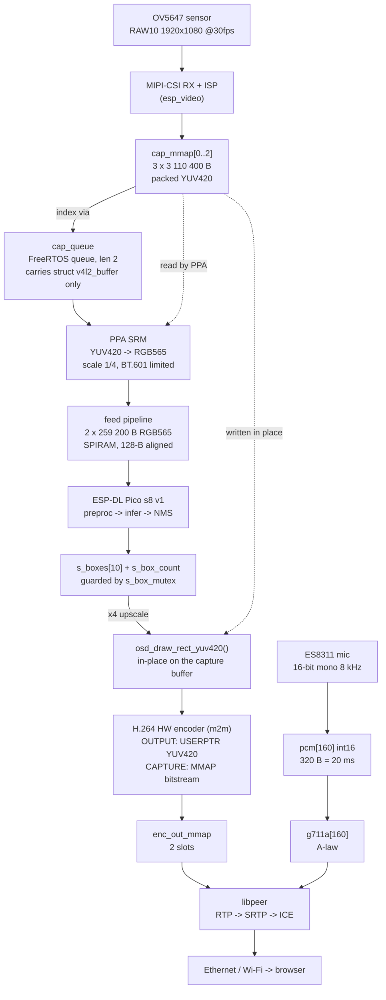
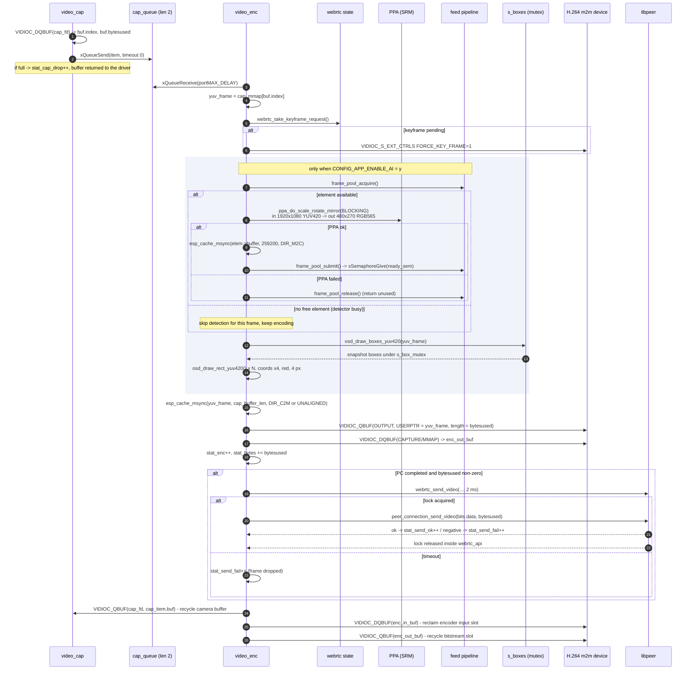
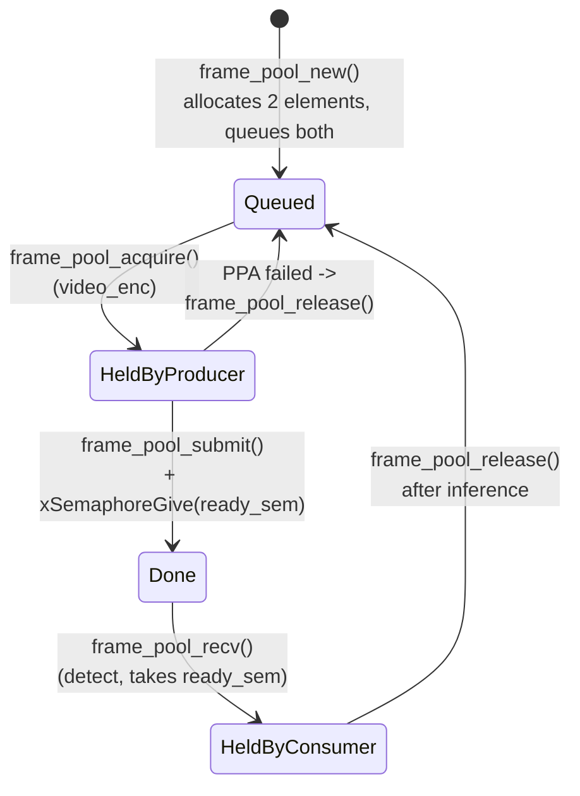
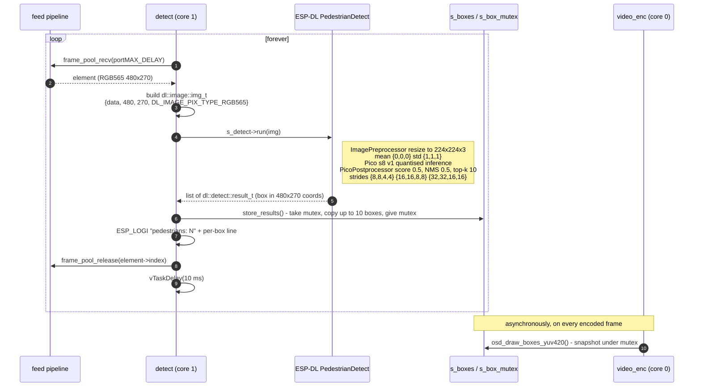
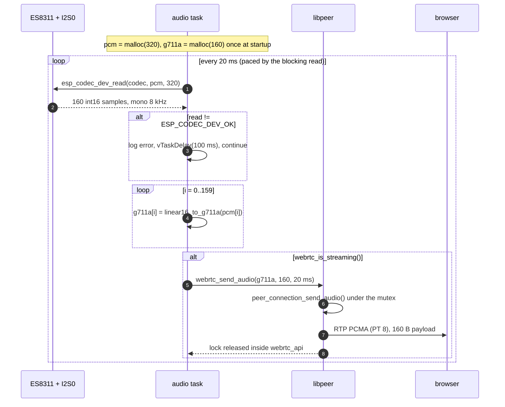
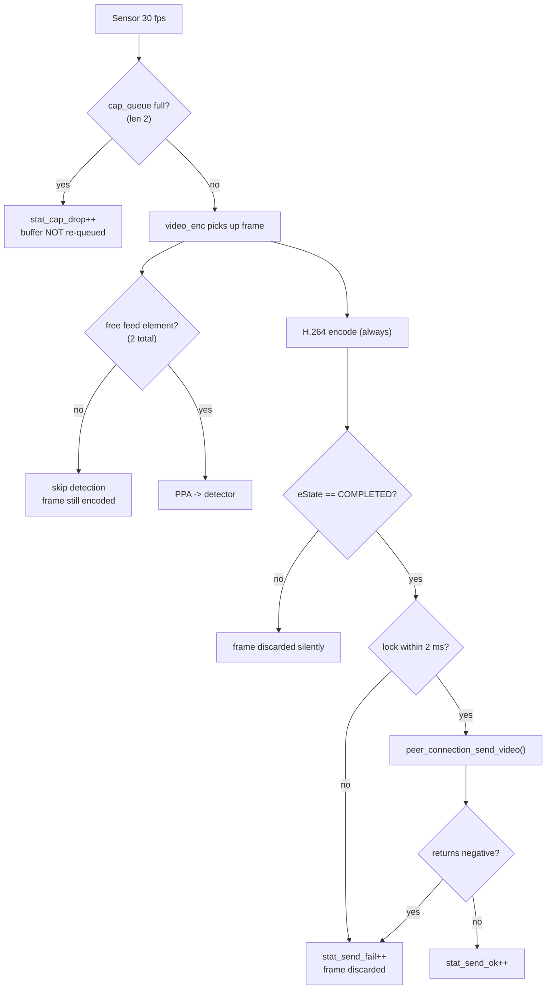
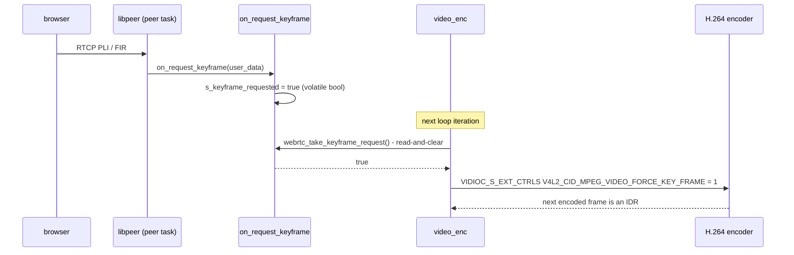

# Data Flow

How bytes actually move through the firmware: buffer ownership, pixel layouts,
handoff points, cache maintenance, timing, and backpressure.

For structure, tasks and boot order see [ARCHITECTURE.md](ARCHITECTURE.md).

---

## 1. End-to-end map



Two independent producer paths (video, audio) converge on a single `PeerConnection`
serialised by the mutex inside `webrtc_api`. The detection path is a **side branch**: it never blocks the
encode path, and its output reaches the stream only as OSD pixels drawn into a later
frame.

---

## 2. Video path, frame by frame

### 2.1 Capture task

`video_capture_task` ([task_video.cpp:141](main/task/task_video.cpp#L141)) is a tight loop
with no delay:

```
VIDIOC_DQBUF(cap_fd, CAPTURE/MMAP) -> item.buf     ; blocks until a frame is ready
stat_cap++
xQueueSend(cap_queue, &item, 0)                    ; non-blocking
  on failure: stat_cap_drop++                      ; buffer is NOT re-queued (see §10)
```

Only the `struct v4l2_buffer` descriptor travels through the queue — 3 MB of pixel data
never gets copied. The consumer resolves `cap_mmap[item.buf.index]` to reach the frame.

### 2.2 Encode task



### 2.3 Buffer ownership over one frame

| Stage                                                  | Owner of`cap_mmap[i]` | Notes                                     |
| ------------------------------------------------------ | ----------------------- | ----------------------------------------- |
| after`VIDIOC_QBUF`                                   | camera DMA              | driver writes ISP output                  |
| after`VIDIOC_DQBUF`                                  | `video_cap`           | descriptor pushed to`cap_queue`         |
| dequeued from`cap_queue`                             | `video_enc`           | read by PPA, then written in place by OSD |
| `VIDIOC_QBUF(OUTPUT, USERPTR)` .. `DQBUF(CAPTURE)` | H.264 encoder           | read-only for the encoder                 |
| after`VIDIOC_QBUF(cap_fd)`                           | camera DMA again        | cycle repeats                             |

The frame is never copied. OSD boxes are drawn **into the same buffer the encoder
reads**, which is why the `DIR_C2M` writeback before `VIDIOC_QBUF(OUTPUT)` is mandatory.

There is one encoder input slot (`REQBUFS count = 1`, `USERPTR`) and
`ENC_OUT_BUF_COUNT = 2` bitstream slots, so the encoder can start the next frame while
the previous bitstream is still being packetised and sent. Each bitstream buffer is
mapped separately and `hal_h264_encode()` returns the pointer for the buffer index the
driver actually handed back, so the send never reads the wrong slot.

---

## 3. Detection side branch

### 3.1 The feed pipeline

[frame_pool.cpp](main/core/frame_pool.cpp) is a two-list ring: every
element is in `queued_list`, in `done_list`, or detached and owned by a task. The `free`
flag means *detached*, not *unused*.



- List mutation is protected by `portMUX_TYPE stream_lock`
  (`portENTER_CRITICAL_SAFE`), so it is ISR-safe; `frame_pool_submit()` is
  `IRAM_ATTR` and branches on `xPortInIsrContext()`.
- `ready_sem` is a counting semaphore with max = `elem_num` (2), initial 0.
- With 2 elements, the producer can be at most one frame ahead of the detector. When
  both are held, `frame_pool_acquire()` returns `NULL` and the encode
  path simply skips detection for that frame — **this is the intended frame-drop
  mechanism for AI**, and it never stalls video.

### 3.2 Detector task



The box store is a **latest-value register**, not a queue. The encoder always draws the
most recent completed detection, whatever frame it came from. Boxes therefore lag the
live image by one inference period (roughly 2–4 frames, see §7).

### 3.3 Coordinate mapping

```
detection space : 480 x 270   (DET_WIDTH  x DET_HEIGHT)
frame space     : 1920 x 1080 (CAM_WIDTH x CAM_HEIGHT)

OSD_SCALE_X = CAM_WIDTH  / DET_WIDTH  = 4
OSD_SCALE_Y = CAM_HEIGHT / DET_HEIGHT = 4
```

480x270 is chosen as an exact 1/3 of 1080p and keeps 16:9, so the upscale is a lossless
integer multiply with no aspect distortion and no letterbox offset to compensate.
`osd_draw_rect_yuv420()` clips out-of-range pixels itself, so rounding at the edges is
harmless.

---

## 4. Pixel formats

### 4.1 Capture / encoder format: packed YUV420 (`O_UYY_E_VYY`)

The ESP32-P4 ISP output and the H.264 encoder input are **not** planar I420. Assuming
planar layout is the single most common source of corrupted OSD output on this chip.

```
stride = width + (width >> 1) = 1.5 * width        ; 2880 B for width = 1920
frame  = stride * height                            ; 3 110 400 B for 1920x1080

one row, repeated in 3-byte groups covering 2 luma pixels each:

  byte:   0     1     2     3     4     5     6     7     8   ...
        +-----+-----+-----+-----+-----+-----+-----+-----+-----+
row y   |  C  | Y0  | Y1  |  C  | Y2  | Y3  |  C  | Y4  | Y5  |
        +-----+-----+-----+-----+-----+-----+-----+-----+-----+
          ^ chroma byte: U when (y & 1) == 0, V when (y & 1) == 1
```

Address arithmetic (see [osd.c:4-19](main/core/osd.c#L4-L19)):

```c
int stride    = width + (width >> 1);
uint8_t *line = buf + (size_t)y * stride;
int group     = x >> 1;

line[group * 3 + 1 + (x & 1)] = Y;                  /* luma  */
line[group * 3]               = (y & 1) ? V : U;    /* chroma */
```

A U sample and a V sample together cover a 2x2 luma block (U from the even row, V from
the odd row) — 4:2:0 subsampling at 12 bits per pixel, hence the 1.5x stride.

### 4.2 Detector format: little-endian RGB565

The PPA emits **standard little-endian** RGB565 (`cfg.byte_swap = false`). esp-dl's
default for camera-direct input is `DL_IMAGE_CAP_RGB565_BIG_ENDIAN`, which would
byte-swap and scramble the colours; the local `pedestrian_detect` component therefore
constructs the `ImagePreprocessor` without that capability flag
([pedestrian_detect.cpp:19-23](components/pedestrian_detect/pedestrian_detect.cpp#L19-L23)).

### 4.3 PPA conversion parameters

| Field                            | Value                                |
| -------------------------------- | ------------------------------------ |
| `in.srm_cm`                    | `PPA_SRM_COLOR_MODE_YUV420`        |
| `in.pic_w/h`, `in.block_w/h` | 1920 x 1080 (full frame, no crop)    |
| `in.yuv_range`                 | `PPA_COLOR_RANGE_LIMIT`            |
| `in.yuv_std`                   | `PPA_COLOR_CONV_STD_RGB_YUV_BT601` |
| `out.srm_cm`                   | `PPA_SRM_COLOR_MODE_RGB565`        |
| `out.pic_w/h`                  | 480 x 270,`buffer_size` 259 200 B  |
| `scale_x`, `scale_y`         | 480/1920 and 270/1080 = 0.25 exactly |
| `rotation_angle`               | `PPA_SRM_ROTATION_ANGLE_0`         |
| `byte_swap`                    | `false`                            |
| `mode`                         | `PPA_TRANS_MODE_BLOCKING`          |

Blocking mode means the encode task stalls for the duration of the PPA operation on
every frame that gets a free feed element.

---

## 5. Audio path

### 5.1 Uplink (device -> browser)



- 320 B PCM -> 160 B A-law: exactly one 20 ms RTP packet, matching WebRTC's default
  PCMA packetisation, so no jitter-buffer reshaping is needed on the browser side.
- `linear16_to_g711a()` ([task_audio.cpp:17-45](main/task/task_audio.cpp#L17-L45)) is the
  standard ITU-T G.711 A-law compander: magnitude, 8-segment log search, `^ 0xD5` for
  positive samples and `^ 0x55` for negative.
- `cfg.audio_codec = CODEC_PCMA` in [task_webrtc.cpp:78](main/task/task_webrtc.cpp#L78) is
  what makes the SDP advertise A-law; changing the encoder here means changing that too.
- The blocking I2S read is the only pacing in this task — there is no `vTaskDelay` on
  the success path.

### 5.2 Downlink (browser -> device): not wired

The codec is opened `ESP_CODEC_DEV_WORK_MODE_BOTH` and both I2S TX and RX channels are
enabled, so the hardware supports two-way audio. But:

- no inbound audio-track callback is registered on the `PeerConnection`, so received
  RTP audio is never routed anywhere;
- `task_speaker` — which would loop the embedded `canon.pcm` through
  `esp_codec_dev_write()` — is compiled and linked but **never created** by `app_main`.

So the speaker path exists only as dead code plus a 625 KB payload in the app partition.

---

## 6. Cache coherency

PSRAM buffers are shared between CPU and DMA masters (ISP, PPA, H.264), so every
handoff needs an explicit `esp_cache_msync()` in the right direction.

| Call site                                     | Buffer                     | Flags                   | Why                                                                                                                   |
| --------------------------------------------- | -------------------------- | ----------------------- | --------------------------------------------------------------------------------------------------------------------- |
| [task_video.cpp:130](main/task/task_video.cpp#L130) | RGB565 feed element        | `DIR_M2C`             | PPA (DMA) just wrote it;**invalidate** so the detector's CPU reads see fresh bytes instead of stale cache lines |
| [task_video.cpp:209](main/task/task_video.cpp#L209) | full YUV420 capture buffer | `DIR_C2M \| UNALIGNED` | the CPU just drew OSD boxes into it;**write back** so the H.264 DMA sees them                                   |

The `UNALIGNED` flag is required on the capture buffer because its length
(3 110 400 B for 1080p) and mmap address are not guaranteed to be multiples of the
128-byte L2 line configured by `CONFIG_CACHE_L2_CACHE_LINE_128B`. The feed elements need
no such flag: `frame_pool_new()` allocates them with
`heap_caps_aligned_calloc(align_size = 128, ...)` and the size 460 800 is itself a
multiple of 128.

---

## 7. Rates and timing budget

Measured on target (1 Hz stats line, `per frame:`), not estimated:

| Stage | Cost per frame | Note |
| --- | --- | --- |
| PPA downscale for the detector | **~85 ms** | the bottleneck — see below |
| OSD draw + publish dirtied rows | 0–2 ms | corner marks dirty two thin bands, not the box height |
| H.264 encode (hardware) | ~40 ms | 1080p, blocking DQBUF |
| WebRTC send | 0.1 ms typical, 35 ms on an IDR | RTP/SRTP packetisation of a large frame |
| **Total, feeding every frame** | **~132 ms → 7.5 fps** | |

The encode loop is fully serial, so these add up to the frame interval, and with
`CAP_BUF_COUNT = 3` the capture rate is pinned to it — which is why `cap_drop` stays 0
and `cap` reads 7–8 rather than the sensor's 30.

### Why the PPA call costs 85 ms

Only part of it is the scaling. `ppa_do_scale_rotate_mirror()` unconditionally
write-backs its **entire input window** before starting the DMA
(`esp_driver_ppa/src/ppa_srm.c`):

```c
uint32_t in_ext_window_len = config->in.pic_w * config->in.block_h * in_pixel_depth / 8;
esp_cache_msync(in_ext_window, in_ext_window_len,
                ESP_CACHE_MSYNC_FLAG_DIR_C2M | ESP_CACHE_MSYNC_FLAG_UNALIGNED);
```

For a 1080p packed-YUV420 source that is 3,110,400 bytes flushed on every call, and
there is no way to opt out through the public API. It is the same full-frame flush that
§6 removed from the application path — reintroduced inside the driver.

**Consequence:** the §6 optimisation only pays off on frames where the PPA is *not*
called. That is what `DET_FEED_EVERY_N` is for: skipping the call buys back both the
scaling and the flush. At `N = 3` the loop averages `(132 + 47 + 47) / 3 ≈ 76 ms`, so
video roughly doubles to ~13 fps while detection settles at ~4/s — well within what the
detector sustains anyway.

### Other rates

| Stage | Rate |
| --- | --- |
| Sensor capture | 30 fps available; consumed at the encode-loop rate |
| ESP-DL inference | **~96–107 ms** measured (`inference avg`), i.e. ~10/s ceiling |
| Audio | 50 packets/s, 20 ms each |
| `peer_connection_loop()` | polled every 1 ms |
| `peer_signaling_loop()` | polled every 10 ms |
| Stats log | 1 Hz |

Inference measures 96–107 ms, above the ~67 ms the component README quotes for
`pico_s8_v1_p4` — that figure is for a different input path, and this one still runs
esp-dl's resize in software. It also drifts upward (to ~107 ms) while WebRTC is
handshaking: the detector owns core 1 but still shares PSRAM bandwidth with core 0.

**Boxes lag the picture.** The box store is a latest-value register, so the encoder
draws the most recent completed detection whatever frame it came from. There is no
motion prediction or smoothing.

There is **no frame pacing** — the encode task runs as fast as `cap_queue` delivers.

RTP timestamping is tied to the same number: libpeer steps the video timestamp by
`90000 / CONFIG_CODEC_H264_FPS`, and that macro is defined once in
[main/core/libpeer_config.h](main/core/libpeer_config.h) and force-included into the
libpeer component, so it cannot drift from `H264_TARGET_FPS`. Audio is the same story:
`CONFIG_AUDIO_DURATION` drives both libpeer's audio timestamp step and the app's
`AUDIO_READ_BYTES`.

---

## 8. Backpressure and drop points



| Drop point                           | Counter            | Effect                                                   |
| ------------------------------------ | ------------------ | -------------------------------------------------------- |
| `cap_queue` full                   | `stat_cap_drop`  | frame dropped; the buffer goes straight back to the driver |
| no free feed element                 | *(none)*         | detection skipped for that frame; video unaffected       |
| PPA failure                          | *(none)*         | element returned unused, detection skipped               |
| PC not`COMPLETED`                  | *(none)*         | encoded frame discarded before send                      |
| `webrtc_send_video` 2 ms timeout   | `stat_send_fail` | encoded frame discarded                                  |
| `peer_connection_send_video() < 0` | `stat_send_fail` | frame rejected by libpeer (ring buffer full)             |

The 1 Hz stats line is the observability surface for all of this:

```
video: 1000ms: cap=30 cap_drop=0 enc=30 send_ok=30 send_fail=0 bitrate=980kbps q_cap=0
```

`q_cap` climbing towards 2 and `cap_drop` becoming non-zero means the encode task cannot
keep up with the sensor — usually because the PPA + OSD + encode chain exceeds 33 ms.

---

## 9. Control plane

The only browser -> device control signal that reaches the media pipeline is the
keyframe request:



`webrtc_take_keyframe_request()` is a non-atomic read-then-clear on a `volatile bool`.
A request arriving in the window between the read and the clear is lost; in practice the
browser retries the PLI, and `H264_I_PERIOD = 60` means an IDR arrives within 60 frames
anyway.

The data channel (`DATA_CHANNEL_BINARY`) is negotiated and its open/close/message
callbacks are registered, but `on_dc_message()` only logs at `ESP_LOGD` level — no
commands are parsed and nothing is ever sent back over it.

---

## 10. Data-flow notes

The defects previously listed here are fixed. What is left is behaviour worth knowing
when reading the numbers:

1. **Boxes lag the picture.** The box store is a latest-value register, not a queue:
   the encoder always draws the most recent completed detection, whatever frame it came
   from. At ~13 inferences/s against 30 fps capture, a given box set is drawn onto 2-3
   consecutive encoded frames. There is no motion prediction or smoothing.

2. **Two PPA passes per detection.** `hal_ppa_yuv420_to_rgb565()` scales 1920x1080 to
   480x270, then esp-dl's `ImagePreprocessor` resizes that to the model's 224x224. The
   second pass currently runs in software — see
   [ARCHITECTURE.md §10](ARCHITECTURE.md#10-known-gaps) for why enabling
   `DL_IMAGE_CAP_PPA` is a measurement, not a given.

3. **Stats counters are non-atomic across tasks.** `stat_cap` / `stat_cap_drop` are
   incremented from `video_cap`, the rest from `video_enc`, and `camera` reads and
   zeroes all of them without synchronisation. Fine for diagnostics; the numbers can be
   off by one and a reset can race with an increment.

4. **RTP timestamps assume 30 fps.** The patched libpeer uses
   `timestamp_increment = 90000 / CONFIG_CODEC_H264_FPS` with `CONFIG_CODEC_H264_FPS 30`.
   If the real encode rate drifts away from 30 fps, playback timing drifts with it.
